# ДОКУМЕНТАЦИЯ ПО ПРОЕКТ ЗА БАЗИ ДАННИ
---

## Дарин Пенчев
Специалност: **СИТ**

Kурс: **2** 

Група: **1A**

Факултетен номер: **24621653**

## СЪДЪРЖАНИЕ

1. [Задание](#1-задание)
2. [Концептуален модел](#2-концептуален-модел)
3. [Логически модел](#3-логически-модел)
4. [Физически модел](#4-физически-модел)
5. [Примерни данни](#5-примерни-данни)
6. [SQL команди](#6-sql-команди)
7. [Резултати от заявки](#7-резултати-от-заявки)
8. [Оптимизация](#8-оптимизация)
9. [Заключение](#9-заключение)

---

## 1. ЗАДАНИЕ

Да се проектира и реализира база от данни за **МАГАЗИН**, която да съхранява следната информация:

### 1.1 Основни данни

- **Продукт**: наименование, група, цена
- **Служител**: име, позиция, телефон
- **Клиент**: име, телефон
- **Продажба**: продукти (множество), клиент, служител, дата, цени

### 1.2 Бизнес правила

1. Всеки продукт принадлежи на **една** група
2. Всеки служител заема **една** позиция/длъжност
3. Всеки клиент може да закупи **много** продукти
4. Всеки служител може да обслужи **много** продажби
5. Всяка продажба може да включва **много** продукти (артикули)
6. Всяка продажба включва един клиент и един служител

### 1.3 Функционални изисквания

**Операции:**
- Въвеждане и корекции на данни
- Търсене/закупуване на продукти по: цена, наименование, група

**Справки:**
- Продажби за период
- Продажби за служител, подредени по дата
- Продажби за клиент
- Оборот и брой продажби по група за период
- Топ продукти по оборот за период

---

## 2. КОНЦЕПТУАЛЕН МОДЕЛ

### 2.1 ER Диаграма

> 
> Файл: `diagrams/ER_Diagram.png`

### 2.2 Entities и атрибути

#### PRODUCT_GROUP (Група продукти)
- **group_id** (PK) - Уникален идентификатор на групата
- **group_name** - Наименование на групата

#### PRODUCT (Продукт)
- **product_id** (PK) - Уникален идентификатор на продукта
- **product_name** - Наименование на продукта
- **group_id** (FK) - Връзка към група
- **price** - Цена на продукта

#### POSITION (Позиция/Длъжност)
- **position_id** (PK) - Уникален идентификатор на позицията
- **position_name** - Наименование на длъжността

#### EMPLOYEE (Служител)
- **employee_id** (PK) - Уникален идентификатор на служителя
- **employee_name** - Име на служителя
- **position_id** (FK) - Връзка към позиция/длъжност
- **phone** - Телефон за връзка

#### CLIENT (Клиент)
- **client_id** (PK) - Уникален идентификатор на клиента
- **client_name** - Име на клиента
- **phone** - Телефон за връзка

#### SALE (Продажба - заглавна част)
- **sale_id** (PK) - Уникален идентификатор на продажбата
- **client_id** (FK) - Връзка към клиент
- **employee_id** (FK) - Връзка към служител
- **sale_date** - Дата на продажбата

#### SALE_ITEM (Артикул в продажба)
- **sale_item_id** (PK) - Уникален идентификатор на реда
- **sale_id** (FK) - Връзка към продажба
- **product_id** (FK) - Връзка към продукт
- **quantity** - Количество
- **unit_price** - Единична цена към момента на продажбата

### 2.3 Релации

```
PRODUCT_GROUP (1) ────< (M) PRODUCT
   └─ Една група съдържа много продукти
   └─ Всеки продукт принадлежи на точно една група

POSITION (1) ────< (M) EMPLOYEE
   └─ Една позиция може да бъде заемана от много служители
   └─ Всеки служител заема точно една позиция

CLIENT (1) ────< (M) SALE
   └─ Един клиент може да направи много покупки

EMPLOYEE (1) ────< (M) SALE
   └─ Един служител може да обслужи много продажби

SALE (1) ────< (M) SALE_ITEM
   └─ Една продажба съдържа много артикули (редове)
   └─ Всеки артикул принадлежи на точно една продажба

PRODUCT (1) ────< (M) SALE_ITEM
   └─ Един продукт може да бъде включен в много продажби
```

### 2.4 Кардиналност и участие

| Релация                | Кардиналност | Участие Parent | Участие Child |
|------------------------|--------------|----------------|---------------|
| PRODUCT_GROUP → PRODUCT| 1:M          | Частично       | Задължително  |
| POSITION → EMPLOYEE    | 1:M          | Частично       | Задължително  |
| CLIENT → SALE          | 1:M          | Частично       | Задължително  |
| EMPLOYEE → SALE        | 1:M          | Частично       | Задължително  |
| SALE → SALE_ITEM       | 1:M          | Задължително   | Задължително  |
| PRODUCT → SALE_ITEM    | 1:M          | Частично       | Задължително  |

---

## 3. ЛОГИЧЕСКИ МОДЕЛ

### 3.1 Нормализация

Моделът е проектиран да отговаря на **Третата Нормална Форма (3NF)**:

#### Първа нормална форма (1NF)
**Изпълнено:**
- Всички атрибути съдържат атомарни (неделими) стойности
- Няма повтарящи се групи от атрибути
- Всяка таблица има първичен ключ
- Всички редове са уникални

#### Втора нормална форма (2NF)
**Изпълнено:**
- Моделът е в 1NF
- Всички неключови атрибути зависят изцяло от първичния ключ
- Няма частични зависимости (всички primary keys са единични, не композитни)

#### Трета нормална форма (3NF)
**Изпълнено:**
- Моделът е в 2NF
- Няма транзитивни зависимости между неключови атрибути
- Групата на продукта е изнесена в отделна таблица PRODUCT_GROUP
- Позицията на служителя е изнесена в отделна таблица POSITION
- Артикулите на продажбата са изнесени в отделна таблица SALE_ITEM
- Цената на артикула се запазва в SALE_ITEM за исторически данни

### 3.2 Обосновка на дизайна

**Защо PRODUCT_GROUP е отделна таблица?**
- Избягване на дублиране на данни (имената на групите се повтарят)
- Улеснява промяна на име на група (един UPDATE вместо много)
- Позволява добавяне на допълнителна информация за групата в бъдеще

**Защо POSITION е отделна таблица?**
- Стандартизиране на длъжностите (избягване на несъответствия като "Продавач" vs "продавач")
- Улеснява промяна на име на позиция (един UPDATE вместо много)
- Позволява добавяне на допълнителна информация за позицията в бъдеще (напр. заплата, ниво)
- Улеснява справки и филтриране по позиция

**Защо SALE_ITEM е отделна таблица?**
- Позволява една продажба да съдържа много продукти (кошница)
- Всеки артикул има собствено количество и цена
- Цената се запазва към момента на продажбата (исторически данни)
- Улеснява анализ на продажби по продукт

**Защо unit_price се дублира в SALE_ITEM?**
- Исторически данни: цената на продукта може да се промени
- Продажбата трябва да запази цената към момента на транзакцията
- Позволява анализ на ценова политика във времето

---

## 4. ФИЗИЧЕСКИ МОДЕЛ

### 4.1 Релационна схема


### 4.2 DDL Скриптове

#### Таблица PRODUCT_GROUP

```sql
CREATE TABLE product_group (
    group_id NUMBER(10) PRIMARY KEY,
    group_name VARCHAR2(100) NOT NULL UNIQUE
);

COMMENT ON TABLE product_group IS 'Групи продукти (електроника, дрехи, храна и т.н.)';
```

#### Таблица PRODUCT

```sql
CREATE TABLE product (
    product_id NUMBER(10) PRIMARY KEY,
    product_name VARCHAR2(200) NOT NULL,
    group_id NUMBER(10) NOT NULL,
    price NUMBER(10, 2) NOT NULL CHECK (price >= 0),
    CONSTRAINT fk_product_group 
        FOREIGN KEY (group_id) 
        REFERENCES product_group(group_id)
        ON DELETE RESTRICT
);

-- Индекси за оптимизация
CREATE INDEX idx_product_name ON product(product_name);
CREATE INDEX idx_product_group ON product(group_id);
CREATE INDEX idx_product_price ON product(price);
```

#### Таблица POSITION

```sql
CREATE TABLE position (
    position_id NUMBER(10) PRIMARY KEY,
    position_name VARCHAR2(100) NOT NULL UNIQUE
);

COMMENT ON TABLE position IS 'Длъжности на служителите (мениджър, продавач, касиер и т.н.)';
```

#### Таблица EMPLOYEE

```sql
CREATE TABLE employee (
    employee_id NUMBER(10) PRIMARY KEY,
    employee_name VARCHAR2(200) NOT NULL,
    position_id NUMBER(10) NOT NULL,
    phone VARCHAR2(20) NOT NULL,
    CONSTRAINT fk_employee_position 
        FOREIGN KEY (position_id) 
        REFERENCES position(position_id)
        ON DELETE RESTRICT
);

CREATE INDEX idx_employee_name ON employee(employee_name);
CREATE INDEX idx_employee_position ON employee(position_id);
```

#### Таблица CLIENT

```sql
CREATE TABLE client (
    client_id NUMBER(10) PRIMARY KEY,
    client_name VARCHAR2(200) NOT NULL,
    phone VARCHAR2(20) NOT NULL
);

CREATE INDEX idx_client_name ON client(client_name);
```

#### Таблица SALE

```sql
CREATE TABLE sale (
    sale_id NUMBER(10) PRIMARY KEY,
    client_id NUMBER(10) NOT NULL,
    employee_id NUMBER(10) NOT NULL,
    sale_date DATE NOT NULL,
    CONSTRAINT fk_sale_client 
        FOREIGN KEY (client_id) REFERENCES client(client_id) ON DELETE RESTRICT,
    CONSTRAINT fk_sale_employee 
        FOREIGN KEY (employee_id) REFERENCES employee(employee_id) ON DELETE RESTRICT
);

CREATE INDEX idx_sale_date ON sale(sale_date);
CREATE INDEX idx_sale_client ON sale(client_id);
CREATE INDEX idx_sale_employee ON sale(employee_id);
```

#### Таблица SALE_ITEM

```sql
CREATE TABLE sale_item (
    sale_item_id NUMBER(10) PRIMARY KEY,
    sale_id NUMBER(10) NOT NULL,
    product_id NUMBER(10) NOT NULL,
    quantity NUMBER(10) NOT NULL CHECK (quantity > 0),
    unit_price NUMBER(10, 2) NOT NULL CHECK (unit_price >= 0),
    CONSTRAINT fk_sale_item_sale 
        FOREIGN KEY (sale_id) REFERENCES sale(sale_id) ON DELETE CASCADE,
    CONSTRAINT fk_sale_item_product 
        FOREIGN KEY (product_id) REFERENCES product(product_id) ON DELETE RESTRICT
);

CREATE INDEX idx_sale_item_sale ON sale_item(sale_id);
CREATE INDEX idx_sale_item_product ON sale_item(product_id);
```

### 4.3 Constraints (Ограничения)

| Тип Constraint    | Таблица        | Описание                                      |
|-------------------|----------------|-----------------------------------------------|
| PRIMARY KEY       | Всички         | Уникален идентификатор на всеки ред           |
| FOREIGN KEY       | PRODUCT        | Връзка към PRODUCT_GROUP                      |
| FOREIGN KEY       | EMPLOYEE       | Връзка към POSITION                           |
| FOREIGN KEY       | SALE           | Връзки към CLIENT, EMPLOYEE                   |
| FOREIGN KEY       | SALE_ITEM      | Връзки към SALE, PRODUCT                      |
| NOT NULL          | Всички         | Задължителни полета                           |
| UNIQUE            | PRODUCT_GROUP  | Уникално име на група                         |
| UNIQUE            | POSITION       | Уникално име на позиция                       |
| CHECK             | PRODUCT        | Цената не може да бъде отрицателна            |
| CHECK             | SALE_ITEM      | Количеството > 0, цената >= 0                 |
| ON DELETE RESTRICT| Повечето FK    | Предотвратява изтриване при съществуващи връзки|
| ON DELETE CASCADE | SALE_ITEM→SALE | Изтрива артикулите при изтриване на продажба  |

### 4.4 Sequences и Views

```sql
-- Автоматично генериране на ID-та
CREATE SEQUENCE seq_product_group START WITH 1 INCREMENT BY 1;
CREATE SEQUENCE seq_product START WITH 1 INCREMENT BY 1;
CREATE SEQUENCE seq_position START WITH 1 INCREMENT BY 1;
CREATE SEQUENCE seq_employee START WITH 1 INCREMENT BY 1;
CREATE SEQUENCE seq_client START WITH 1 INCREMENT BY 1;
CREATE SEQUENCE seq_sale START WITH 1 INCREMENT BY 1;
CREATE SEQUENCE seq_sale_item START WITH 1 INCREMENT BY 1;

-- View за детайлна информация за продажби
CREATE OR REPLACE VIEW v_sale_details AS
SELECT 
    s.sale_id, s.sale_date,
    c.client_name, c.phone AS client_phone,
    e.employee_name, pos.position_name AS employee_position,
    p.product_name, pg.group_name,
    si.quantity, si.unit_price,
    (si.quantity * si.unit_price) AS line_total
FROM sale s
JOIN client c ON s.client_id = c.client_id
JOIN employee e ON s.employee_id = e.employee_id
JOIN position pos ON e.position_id = pos.position_id
JOIN sale_item si ON s.sale_id = si.sale_id
JOIN product p ON si.product_id = p.product_id
JOIN product_group pg ON p.group_id = pg.group_id;

-- View за обобщение на продажби
CREATE OR REPLACE VIEW v_sale_summary AS
SELECT 
    s.sale_id, s.sale_date,
    c.client_name, e.employee_name,
    COUNT(si.sale_item_id) AS items_count,
    SUM(si.quantity) AS total_quantity,
    SUM(si.quantity * si.unit_price) AS total_amount
FROM sale s
JOIN client c ON s.client_id = c.client_id
JOIN employee e ON s.employee_id = e.employee_id
JOIN sale_item si ON s.sale_id = si.sale_id
GROUP BY s.sale_id, s.sale_date, c.client_name, e.employee_name;
```

---

## 5. ПРИМЕРНИ ДАННИ

### 5.1 Статистика

| Таблица        | Брой записи | Описание                          |
|----------------|-------------|-----------------------------------|
| PRODUCT_GROUP  | 6           | Категории продукти                |
| PRODUCT        | 30          | Различни продукти                 |
| POSITION       | 4           | Длъжности на служителите          |
| EMPLOYEE       | 5           | Служители на магазина             |
| CLIENT         | 10          | Регистрирани клиенти              |
| SALE           | 25          | Продажби за период 5 месеца       |
| SALE_ITEM      | 47          | Артикули в продажбите             |

### 5.2 Групи продукти

1. **Електроника** - Лаптопи, телефони, аксесоари
2. **Дрехи** - Облекло и обувки
3. **Храна и напитки** - Хранителни стоки
4. **Козметика** - Козметични продукти
5. **Книги** - Литература и учебници
6. **Спортни стоки** - Спортно оборудване

### 5.3 Позиции/Длъжности

| ID | Позиция          | Описание                                    |
|----|------------------|---------------------------------------------|
| 1  | Мениджър         | Управлява магазина и персонала              |
| 2  | Продавач         | Обслужва клиенти и извършва продажби        |
| 3  | Старши продавач  | Опитен продавач с допълнителни отговорности |
| 4  | Касиер           | Обработва плащания на касата                |

### 5.4 Примерни продукти (извадка)

| ID | Продукт                    | Група           | Цена (лв) |
|----|----------------------------|-----------------|-----------|
| 1  | Лаптоп Dell XPS 15         | Електроника     | 2,499.99  |
| 2  | Смартфон iPhone 14         | Електроника     | 1,899.00  |
| 6  | Дънки Levi's 501           | Дрехи           | 129.99    |
| 11 | Кафе Lavazza 1кг           | Храна и напитки | 18.50     |
| 12 | Шоколад Milka 100г         | Храна и напитки | 2.49      |
| 29 | Велосипед Trek Mountain    | Спортни стоки   | 899.00    |

### 5.5 Служители

| ID | Име                  | Позиция          | Телефон        |
|----|----------------------|------------------|----------------|
| 1  | Иван Петров          | Мениджър         | +359888111222  |
| 2  | Мария Димитрова      | Продавач         | +359888222333  |
| 3  | Георги Стоянов       | Продавач         | +359888333444  |
| 4  | Елена Иванова        | Старши продавач  | +359888444555  |
| 5  | Петър Георгиев       | Касиер           | +359888555666  |

### 5.6 Примерна продажба (кошница)

**Продажба #1** (05.01.2024, Клиент: Анна Николова, Служител: Мария Димитрова)

| Продукт                    | Количество | Ед. цена | Сума      |
|----------------------------|------------|----------|-----------|
| Лаптоп Dell XPS 15         | 1          | 2,499.99 | 2,499.99  |
| Мишка Logitech MX Master   | 1          | 99.99    | 99.99     |
| **Общо:**                  | **2**      |          | **2,599.98** |

### 5.7 Период на данните

- **Начало:** 01.01.2024
- **Край:** 31.05.2024
- **Продължителност:** 5 месеца
- **Брой транзакции:** 25
- **Брой артикули:** 47

---

## 6. SQL КОМАНДИ

### 6.1 DDL - Data Definition Language

**Файл:** `ddl_create_tables.sql`

Съдържа:
- `CREATE TABLE` за 7 таблици
- 14 индекса за оптимизация
- 7 sequences за автоматично генериране на ID
- 2 views за детайлни справки
- Коментари на всички таблици и колони

### 6.2 DML - Data Manipulation Language

**Файл:** `dml_sample_data.sql`

**INSERT команди:**
- 6 групи продукти
- 30 продукта (по 5 от всяка група)
- 4 позиции/длъжности
- 5 служителя
- 10 клиента
- 25 продажби
- 47 артикула в продажбите

**UPDATE и DELETE примери:**
```sql
-- Корекция на цена
UPDATE product SET price = 2399.99 WHERE product_id = 1;

-- Промяна на телефон
UPDATE employee SET phone = '+359888111333' WHERE employee_id = 1;

-- Изтриване на продажба (CASCADE изтрива и артикулите)
DELETE FROM sale WHERE sale_id = 26;
```

### 6.3 DQL - Data Query Language

**Файл:** `queries.sql`

Съдържа **24 заявки** организирани в 6 категории:
1. Въвеждане и корекции (5 заявки)
2. Търсене на продукти (5 заявки)
3. Справки за продажби (6 заявки)
4. Оборот по група (2 заявки)
5. Топ продукти (3 заявки)
6. Допълнителни анализи (12 заявки)

---

## 7. РЕЗУЛТАТИ ОТ ЗАЯВКИТЕ

Този раздел съдържа подробна документация на всички SQL заявки от файла `queries.sql`. За всяка заявка е предоставена информация за нейната цел, SQL код и резултати.

---

### ЧАСТ 1: ВЪВЕЖДАНЕ И КОРЕКЦИИ НА ДАННИ

#### Заявка 0: Синхронизация на sequences с текущите данни

**Описание:** PL/SQL блок за синхронизация на sequences след въвеждане на данни. Използва се само веднъж след първоначално зареждане на данни.

**SQL:**
```sql
DECLARE
   v_max_product_group NUMBER;
   -- ... (пълният код в queries.sql)
END;
/
```


#### Заявка 1.1: Добавяне на нов продукт

**Описание:** Въвеждане на нов продукт в базата данни с автоматично генериране на ID чрез sequence.

**SQL:**
```sql
INSERT INTO product (product_id, product_name, group_id, price) 
VALUES (seq_product.NEXTVAL, 'Клавиатура Corsair K95', 1, 199.99);
```

#### Заявка 1.2: Корекция на цена на продукт

**Описание:** Актуализиране на цената на съществуващ продукт.

**SQL:**
```sql
UPDATE product 
SET price = 2399.99 
WHERE product_id = 1;
```

#### Заявка 1.3: Добавяне на нов клиент

**Описание:** Въвеждане на нов клиент с автоматично генериране на ID.

**SQL:**
```sql
INSERT INTO client (client_id, client_name, phone) 
VALUES (seq_client.NEXTVAL, 'Иван Ангелов', '+359887111222');
```

#### Заявка 1.4: Корекция на телефон на служител

**Описание:** Актуализиране на телефонния номер на служител.

**SQL:**
```sql
UPDATE employee 
SET phone = '+359888111333' 
WHERE employee_id = 1;
```

---

#### Заявка 1.5: Изтриване на продукт

**Описание:** Изтриване на продукт (коментирана заявка - изпълнява се само ако продуктът няма продажби).

**SQL:**
```sql
-- DELETE FROM product WHERE product_id = 31;
```

---

### ЧАСТ 2: ТЪРСЕНЕ НА ПРОДУКТИ

#### Заявка 2.1: Търсене по цена (продукти под 50 лв)

**Описание:** Извличане на всички продукти с цена под 50 лв, подредени по цена възходящо.

**SQL:**
```sql
SELECT product_id, product_name, price, 
       (SELECT group_name FROM product_group WHERE group_id = p.group_id) AS grupa
FROM product p
WHERE price < 50
ORDER BY price ASC;
```

**Резултат:**
> 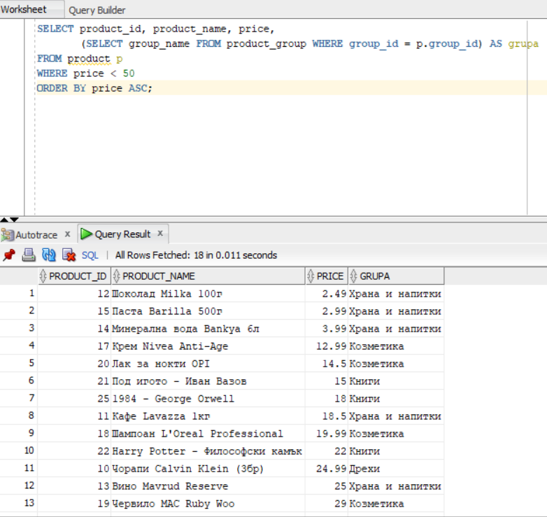
> Файл: `query_results/2.1.png`

---

#### Заявка 2.2: Търсене по цена в диапазон (между 100 и 500 лв)

**Описание:** Извличане на продукти с цена между 100 и 500 лв.

**SQL:**
```sql
SELECT product_id, product_name, price,
       (SELECT group_name FROM product_group WHERE group_id = p.group_id) AS grupa
FROM product p
WHERE price BETWEEN 100 AND 500
ORDER BY price ASC;
```

**Резултат:**
> 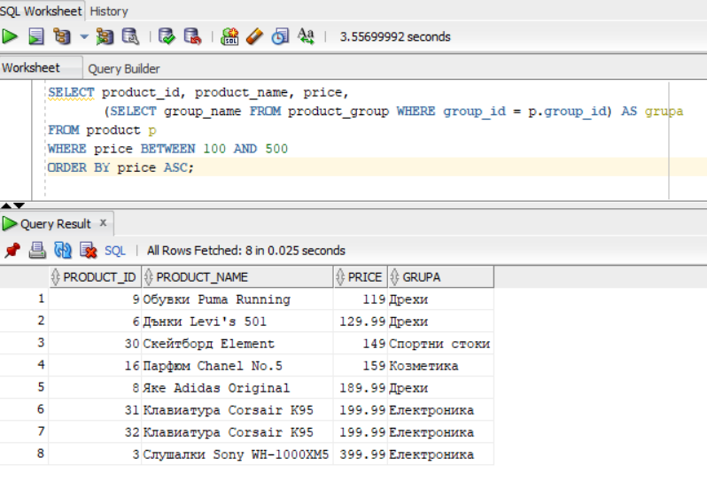
> Файл: `query_results/2.2.png`

---

#### Заявка 2.3: Търсене по наименование (съдържа "Nike")

**Описание:** Търсене на продукти по име, съдържащо текста "Nike" (case-insensitive).

**SQL:**
```sql
SELECT product_id, product_name, price,
       (SELECT group_name FROM product_group WHERE group_id = p.group_id) AS grupa
FROM product p
WHERE UPPER(product_name) LIKE UPPER('%Nike%')
ORDER BY product_name;
```

**Резултат:**
> 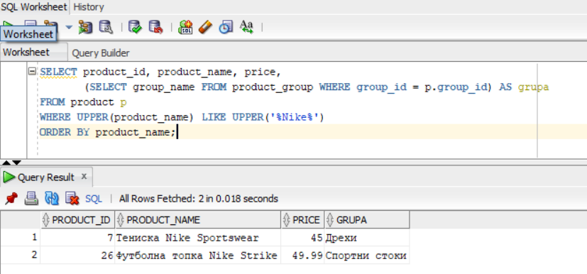
> Файл: `query_results/2.3.png`

---

#### Заявка 2.4: Търсене по група (всички продукти от група "Електроника")

**Описание:** Извличане на всички продукти от група "Електроника" с JOIN операция.

**SQL:**
```sql
SELECT p.product_id, p.product_name, p.price
FROM product p
JOIN product_group pg ON p.group_id = pg.group_id
WHERE pg.group_name = 'Електроника'
ORDER BY p.price DESC;
```

**Резултат:**
> 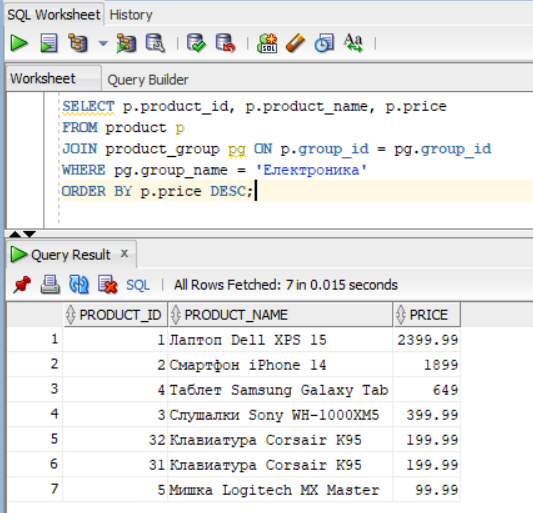
> Файл: `query_results/2.4.png`

---

#### Заявка 2.5: Търсене по група с ID

**Описание:** Извличане на продукти по ID на групата (group_id = 1).

**SQL:**
```sql
SELECT product_id, product_name, price
FROM product
WHERE group_id = 1
ORDER BY price DESC;
```

**Резултат:**
> 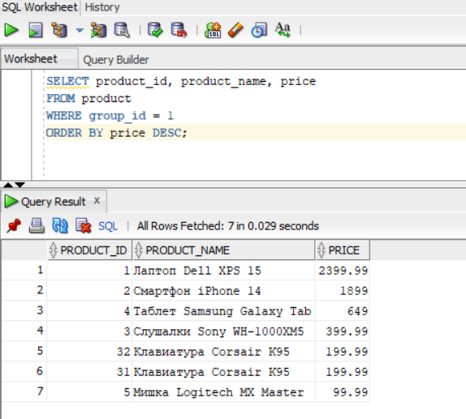
> Файл: `query_results/2.5.png`

---

### ЧАСТ 3: СПРАВКИ ЗА ПРОДАЖБИ

#### Заявка 3.1: ПРОДАЖБИ ЗА ПЕРИОД (Януари - Март 2024) - детайлен изглед

**Описание:** Детайлна информация за всички продажби в периода януари-март 2024, включваща всички артикули от всяка продажба.

**SQL:**
```sql
SELECT 
    s.sale_id AS "ID Продажба",
    s.sale_date AS "Дата",
    c.client_name AS "Клиент",
    e.employee_name AS "Служител",
    p.product_name AS "Продукт",
    pg.group_name AS "Група",
    si.quantity AS "Количество",
    si.unit_price AS "Ед. цена",
    (si.quantity * si.unit_price) AS "Сума"
FROM sale s
JOIN client c ON s.client_id = c.client_id
JOIN employee e ON s.employee_id = e.employee_id
JOIN sale_item si ON s.sale_id = si.sale_id
JOIN product p ON si.product_id = p.product_id
JOIN product_group pg ON p.group_id = pg.group_id
WHERE s.sale_date BETWEEN TO_DATE('2024-01-01', 'YYYY-MM-DD') 
                     AND TO_DATE('2024-03-31', 'YYYY-MM-DD')
ORDER BY s.sale_date ASC, s.sale_id, si.sale_item_id;
```

**Резултат:**
> 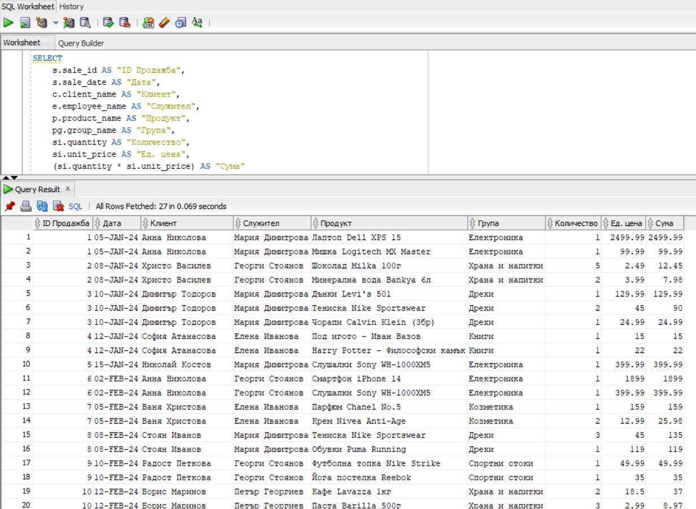
> Файл: `query_results/3.1.png`

---

#### Заявка 3.2: ПРОДАЖБИ ЗА ПЕРИОД - обобщение по продажба

**Описание:** Обобщена информация за продажбите в периода януари-март 2024, групирана по продажба с общ брой артикули и обща сума.

**SQL:**
```sql
SELECT 
    s.sale_id AS "ID Продажба",
    s.sale_date AS "Дата",
    c.client_name AS "Клиент",
    e.employee_name AS "Служител",
    COUNT(si.sale_item_id) AS "Брой артикули",
    SUM(si.quantity) AS "Общо количество",
    SUM(si.quantity * si.unit_price) AS "Обща сума"
FROM sale s
JOIN client c ON s.client_id = c.client_id
JOIN employee e ON s.employee_id = e.employee_id
JOIN sale_item si ON s.sale_id = si.sale_id
WHERE s.sale_date BETWEEN TO_DATE('2024-01-01', 'YYYY-MM-DD') 
                     AND TO_DATE('2024-03-31', 'YYYY-MM-DD')
GROUP BY s.sale_id, s.sale_date, c.client_name, e.employee_name
ORDER BY s.sale_date ASC;
```

**Резултат:**
> 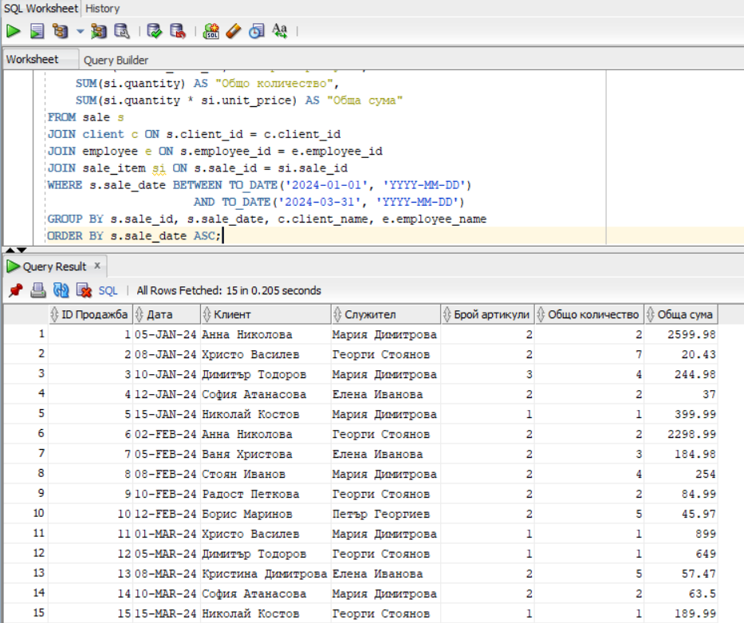
> Файл: `query_results/3.2.png`

---

#### Заявка 3.3: ПРОДАЖБИ ЗА СЛУЖИТЕЛ, ПОДРЕДЕНИ ПО ДАТА

**Описание:** Всички продажби на служител с ID = 2 (Мария Димитрова), подредени по дата.

**SQL:**
```sql
SELECT 
    s.sale_id AS "ID Продажба",
    s.sale_date AS "Дата",
    c.client_name AS "Клиент",
    COUNT(si.sale_item_id) AS "Брой артикули",
    SUM(si.quantity * si.unit_price) AS "Обща сума"
FROM sale s
JOIN client c ON s.client_id = c.client_id
JOIN sale_item si ON s.sale_id = si.sale_id
WHERE s.employee_id = 2
GROUP BY s.sale_id, s.sale_date, c.client_name
ORDER BY s.sale_date ASC;
```

**Резултат:**
> 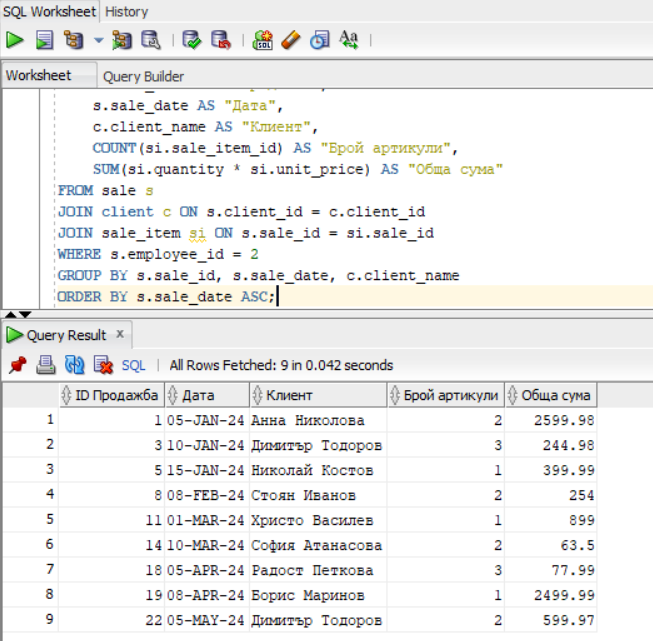
> Файл: `query_results/3.3.png`

---

#### Заявка 3.4: ПРОДАЖБИ ЗА СЛУЖИТЕЛ С ИМЕ - детайлен изглед

**Описание:** Детайлна информация за всички продажби на служител "Мария Димитрова", включваща всички артикули.

**SQL:**
```sql
SELECT 
    e.employee_name AS "Служител",
    s.sale_date AS "Дата",
    c.client_name AS "Клиент",
    p.product_name AS "Продукт",
    si.quantity AS "Количество",
    si.unit_price AS "Ед. цена",
    (si.quantity * si.unit_price) AS "Сума"
FROM sale s
JOIN client c ON s.client_id = c.client_id
JOIN employee e ON s.employee_id = e.employee_id
JOIN sale_item si ON s.sale_id = si.sale_id
JOIN product p ON si.product_id = p.product_id
WHERE e.employee_name = 'Мария Димитрова'
ORDER BY s.sale_date ASC;
```

**Резултат:**
> 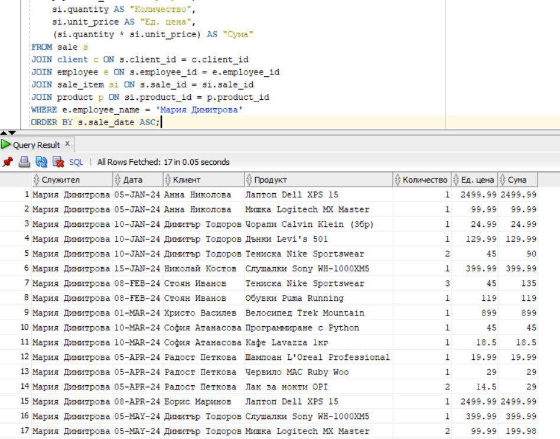
> Файл: `query_results/3.4.png`

---

#### Заявка 3.5: ПРОДАЖБИ ЗА КЛИЕНТ

**Описание:** Детайлна информация за всички покупки на клиент с ID = 1 (Анна Николова).

**SQL:**
```sql
SELECT 
    c.client_name AS "Клиент",
    c.phone AS "Телефон",
    s.sale_date AS "Дата",
    e.employee_name AS "Обслужил",
    p.product_name AS "Продукт",
    pg.group_name AS "Група",
    si.quantity AS "Количество",
    si.unit_price AS "Ед. цена",
    (si.quantity * si.unit_price) AS "Сума"
FROM sale s
JOIN client c ON s.client_id = c.client_id
JOIN employee e ON s.employee_id = e.employee_id
JOIN sale_item si ON s.sale_id = si.sale_id
JOIN product p ON si.product_id = p.product_id
JOIN product_group pg ON p.group_id = pg.group_id
WHERE s.client_id = 1
ORDER BY s.sale_date DESC, si.sale_item_id;
```

**Резултат:**
> 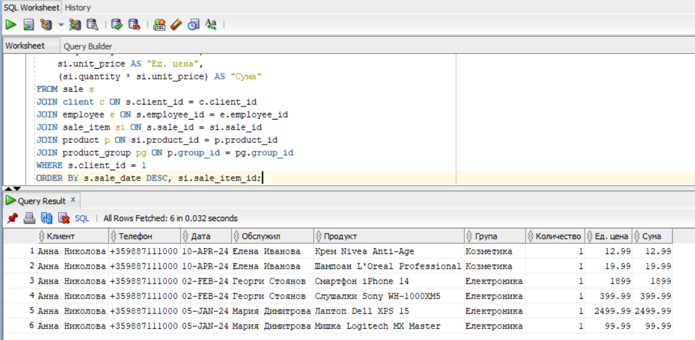
> Файл: `query_results/3.5.png`

---

#### Заявка 3.6: ПРОДАЖБИ ЗА КЛИЕНТ - обобщение

**Описание:** Обобщена информация за покупките на клиент "Анна Николова", групирана по продажба.

**SQL:**
```sql
SELECT 
    c.client_name AS "Клиент",
    s.sale_date AS "Дата",
    COUNT(si.sale_item_id) AS "Брой артикули",
    SUM(si.quantity * si.unit_price) AS "Обща сума"
FROM sale s
JOIN client c ON s.client_id = c.client_id
JOIN sale_item si ON s.sale_id = si.sale_id
WHERE c.client_name = 'Анна Николова'
GROUP BY c.client_name, s.sale_id, s.sale_date
ORDER BY s.sale_date DESC;
```

**Резултат:**
> 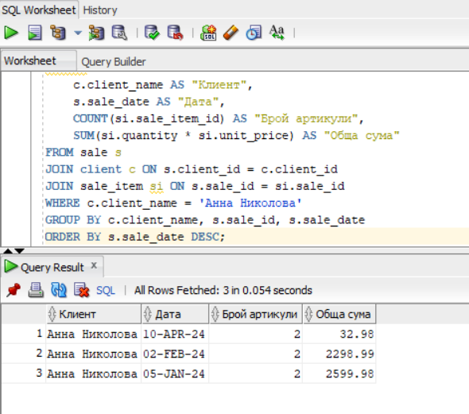
> Файл: `query_results/3.6.png`

---

### ЧАСТ 4: ОБОРОТ И БРОЙ ПРОДАЖБИ ПО ГРУПА

#### Заявка 4.1: ОБОРОТ И БРОЙ ПРОДАЖБИ ПО ГРУПА ЗА ПЕРИОД (Цяла 2024)

**Описание:** Статистика за оборот и брой продажби по група продукти за цялата 2024 година.

**SQL:**
```sql
SELECT 
    pg.group_name AS "Група",
    COUNT(DISTINCT s.sale_id) AS "Брой продажби",
    SUM(si.quantity) AS "Продадени бройки",
    SUM(si.quantity * si.unit_price) AS "Общ оборот (лв)",
    ROUND(AVG(si.unit_price), 2) AS "Средна ед. цена (лв)"
FROM sale s
JOIN sale_item si ON s.sale_id = si.sale_id
JOIN product p ON si.product_id = p.product_id
JOIN product_group pg ON p.group_id = pg.group_id
WHERE s.sale_date BETWEEN TO_DATE('2024-01-01', 'YYYY-MM-DD') 
                     AND TO_DATE('2024-12-31', 'YYYY-MM-DD')
GROUP BY pg.group_name
ORDER BY SUM(si.quantity * si.unit_price) DESC;
```

**Резултат:**
> 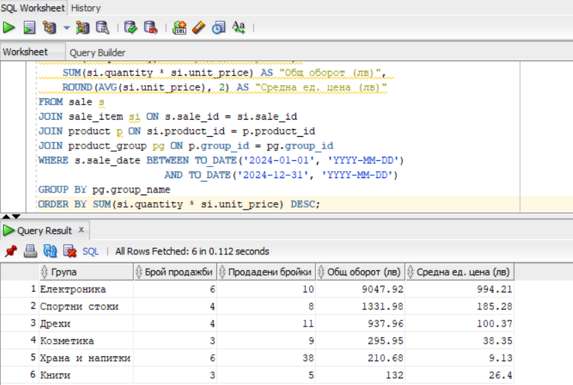
> Файл: `query_results/4.1.png`

---

#### Заявка 4.2: ОБОРОТ И БРОЙ ПРОДАЖБИ ПО ГРУПА ЗА Q1 2024

**Описание:** Статистика по групи за първото тримесечие на 2024 година, включваща процент от общия оборот.

**SQL:**
```sql
SELECT 
    pg.group_name AS "Група",
    COUNT(DISTINCT s.sale_id) AS "Брой продажби",
    SUM(si.quantity) AS "Продадени бройки",
    SUM(si.quantity * si.unit_price) AS "Общ оборот (лв)",
    ROUND(SUM(si.quantity * si.unit_price) * 100.0 / 
        (SELECT SUM(si2.quantity * si2.unit_price) 
         FROM sale s2 
         JOIN sale_item si2 ON s2.sale_id = si2.sale_id
         WHERE s2.sale_date BETWEEN TO_DATE('2024-01-01', 'YYYY-MM-DD') 
                                AND TO_DATE('2024-03-31', 'YYYY-MM-DD')), 2) AS "% от оборота"
FROM sale s
JOIN sale_item si ON s.sale_id = si.sale_id
JOIN product p ON si.product_id = p.product_id
JOIN product_group pg ON p.group_id = pg.group_id
WHERE s.sale_date BETWEEN TO_DATE('2024-01-01', 'YYYY-MM-DD') 
                     AND TO_DATE('2024-03-31', 'YYYY-MM-DD')
GROUP BY pg.group_name
ORDER BY SUM(si.quantity * si.unit_price) DESC;
```

**Резултат:**
> 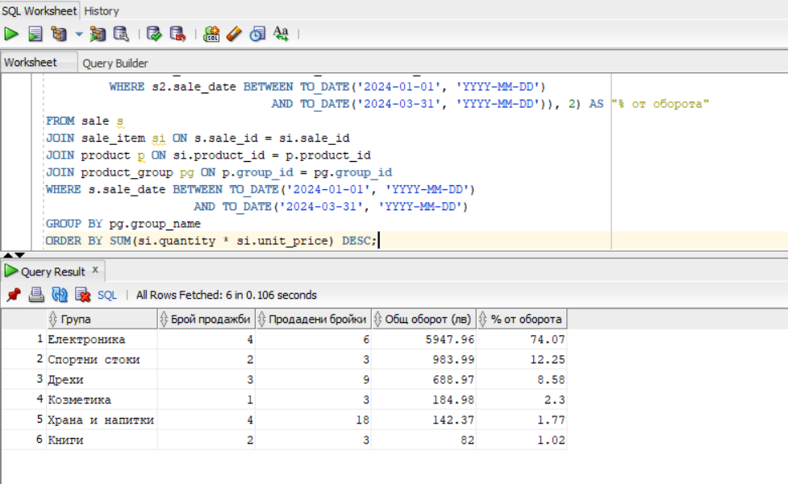
> Файл: `query_results/4.2.png`

---

### ЧАСТ 5: ТОП ПРОДУКТИ ПО ОБОРОТ

#### Заявка 5.1: ТОП 10 ПРОДУКТИ ПО ОБОРОТ ЗА ПЕРИОД (Цяла 2024)

**Описание:** Топ 10 продукти по общ оборот за цялата 2024 година.

**SQL:**
```sql
SELECT 
    p.product_name AS "Продукт",
    pg.group_name AS "Група",
    SUM(si.quantity) AS "Продадени бройки",
    SUM(si.quantity * si.unit_price) AS "Общ оборот (лв)",
    ROUND(AVG(si.unit_price), 2) AS "Средна цена (лв)"
FROM sale s
JOIN sale_item si ON s.sale_id = si.sale_id
JOIN product p ON si.product_id = p.product_id
JOIN product_group pg ON p.group_id = pg.group_id
WHERE s.sale_date BETWEEN TO_DATE('2024-01-01', 'YYYY-MM-DD') 
                     AND TO_DATE('2024-12-31', 'YYYY-MM-DD')
GROUP BY p.product_name, pg.group_name
ORDER BY SUM(si.quantity * si.unit_price) DESC
FETCH FIRST 10 ROWS ONLY;
```

**Резултат:**
> 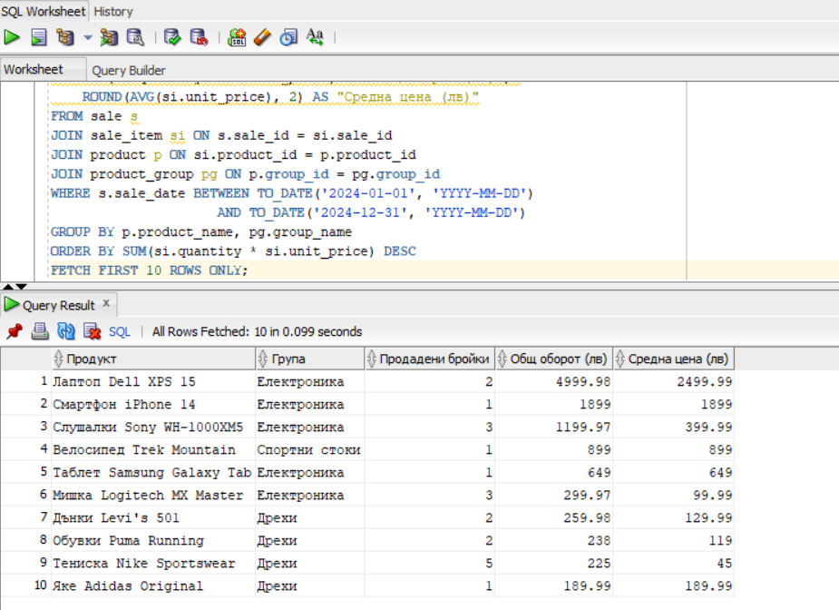
> Файл: `query_results/5.1.png`

---

#### Заявка 5.2: ТОП 5 ПРОДУКТИ ПО ОБОРОТ ЗА Q2 2024

**Описание:** Топ 5 продукти по оборот за второто тримесечие на 2024 година.

**SQL:**
```sql
SELECT 
    p.product_name AS "Продукт",
    pg.group_name AS "Група",
    SUM(si.quantity) AS "Продадени бройки",
    SUM(si.quantity * si.unit_price) AS "Общ оборот (лв)"
FROM sale s
JOIN sale_item si ON s.sale_id = si.sale_id
JOIN product p ON si.product_id = p.product_id
JOIN product_group pg ON p.group_id = pg.group_id
WHERE s.sale_date BETWEEN TO_DATE('2024-04-01', 'YYYY-MM-DD') 
                     AND TO_DATE('2024-06-30', 'YYYY-MM-DD')
GROUP BY p.product_name, pg.group_name
ORDER BY SUM(si.quantity * si.unit_price) DESC
FETCH FIRST 5 ROWS ONLY;
```

**Резултат:**
> 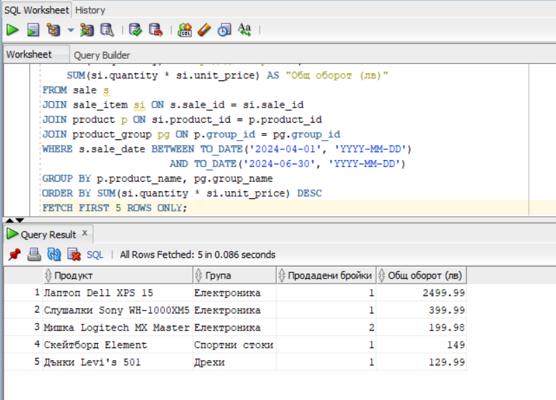
> Файл: `query_results/5.2.png`

---

#### Заявка 5.3: ТОП 10 ПРОДУКТИ ПО БРОЙ ПРОДАЖБИ

**Описание:** Топ 10 продукти по брой продажби (в колко различни продажби са включени).

**SQL:**
```sql
SELECT 
    p.product_name AS "Продукт",
    pg.group_name AS "Група",
    SUM(si.quantity) AS "Продадени бройки",
    COUNT(DISTINCT s.sale_id) AS "В колко продажби",
    SUM(si.quantity * si.unit_price) AS "Общ оборот (лв)"
FROM sale s
JOIN sale_item si ON s.sale_id = si.sale_id
JOIN product p ON si.product_id = p.product_id
JOIN product_group pg ON p.group_id = pg.group_id
WHERE s.sale_date BETWEEN TO_DATE('2024-01-01', 'YYYY-MM-DD') 
                     AND TO_DATE('2024-12-31', 'YYYY-MM-DD')
GROUP BY p.product_name, pg.group_name
ORDER BY SUM(si.quantity) DESC, SUM(si.quantity * si.unit_price) DESC
FETCH FIRST 10 ROWS ONLY;
```

**Резултат:**
> 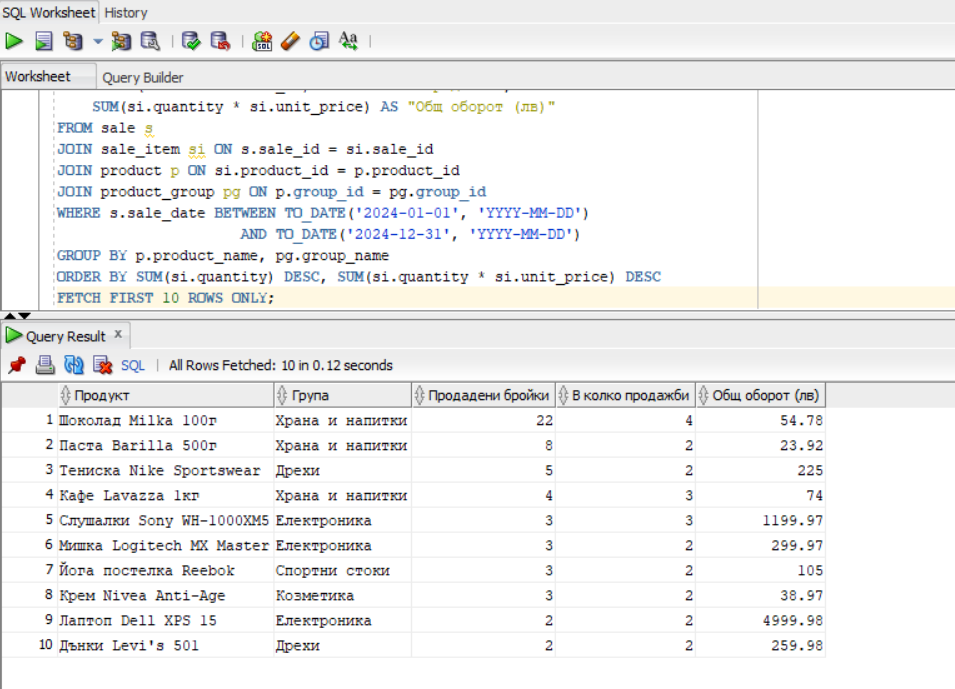
> Файл: `query_results/5.3.png`

---

### ЧАСТ 6: ДОПЪЛНИТЕЛНИ ПОЛЕЗНИ СПРАВКИ

#### Заявка 6.1: Обща статистика за магазина

**Описание:** Обобщена статистика за магазина - общ брой продукти, клиенти, служители, продажби и общ оборот.

**SQL:**
```sql
SELECT 
    (SELECT COUNT(*) FROM product) AS "Общо продукти",
    (SELECT COUNT(*) FROM client) AS "Общо клиенти",
    (SELECT COUNT(*) FROM employee) AS "Общо служители",
    (SELECT COUNT(*) FROM sale) AS "Общо продажби",
    (SELECT COUNT(*) FROM sale_item) AS "Общо артикули",
    (SELECT ROUND(SUM(quantity * unit_price), 2) FROM sale_item) AS "Общ оборот (лв)"
FROM DUAL;
```

**Резултат:**
> 
> Файл: `query_results/6.1.png`

---

#### Заявка 6.2: Най-активен служител (по брой продажби и оборот)

**Описание:** Статистика за всеки служител по брой продажби, продадени артикули и общ оборот.

**SQL:**
```sql
SELECT 
    e.employee_name AS "Служител",
    pos.position_name AS "Позиция",
    COUNT(DISTINCT s.sale_id) AS "Брой продажби",
    SUM(si.quantity) AS "Продадени артикули",
    ROUND(SUM(si.quantity * si.unit_price), 2) AS "Общ оборот (лв)",
    ROUND(AVG(si.quantity * si.unit_price), 2) AS "Средна стойност на артикул (лв)"
FROM sale s
JOIN employee e ON s.employee_id = e.employee_id
JOIN position pos ON e.position_id = pos.position_id
JOIN sale_item si ON s.sale_id = si.sale_id
GROUP BY e.employee_name, pos.position_name
ORDER BY SUM(si.quantity * si.unit_price) DESC;
```

**Резултат:**
> 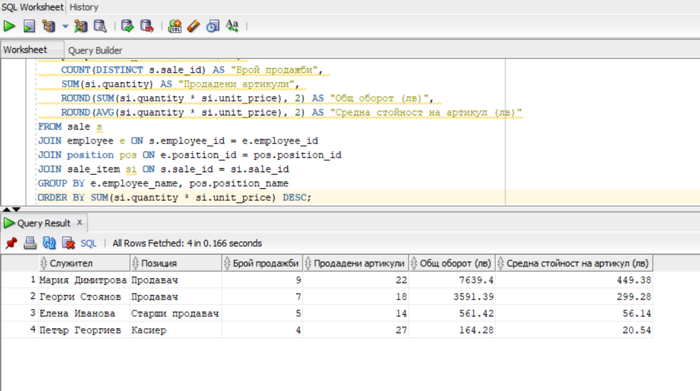
> Файл: `query_results/6.2.png`

---

#### Заявка 6.3: Най-активен клиент (по брой покупки и обща сума)

**Описание:** Статистика за всеки клиент по брой покупки, общо артикули и обща сума.

**SQL:**
```sql
SELECT 
    c.client_name AS "Клиент",
    c.phone AS "Телефон",
    COUNT(DISTINCT s.sale_id) AS "Брой покупки",
    SUM(si.quantity) AS "Общо артикули",
    ROUND(SUM(si.quantity * si.unit_price), 2) AS "Обща сума (лв)",
    ROUND(AVG(si.quantity * si.unit_price), 2) AS "Средна стойност на артикул (лв)"
FROM sale s
JOIN client c ON s.client_id = c.client_id
JOIN sale_item si ON s.sale_id = si.sale_id
GROUP BY c.client_name, c.phone
ORDER BY SUM(si.quantity * si.unit_price) DESC;
```

**Резултат:**
> 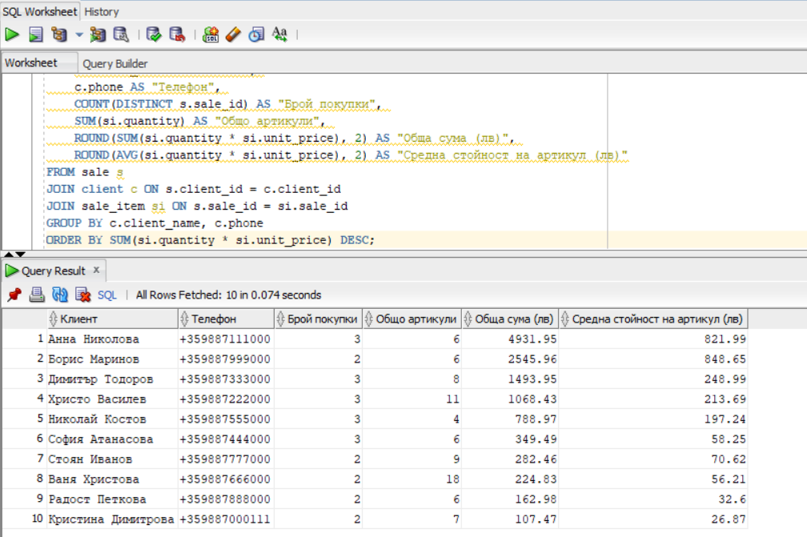
> Файл: `query_results/6.3.png`

---

#### Заявка 6.4: Месечен оборот за 2024

**Описание:** Статистика за оборот по месеци за 2024 година.

**SQL:**
```sql
SELECT 
    TO_CHAR(s.sale_date, 'YYYY-MM') AS "Месец",
    COUNT(DISTINCT s.sale_id) AS "Брой продажби",
    SUM(si.quantity) AS "Продадени артикули",
    ROUND(SUM(si.quantity * si.unit_price), 2) AS "Оборот (лв)",
    ROUND(AVG(si.quantity * si.unit_price), 2) AS "Средна стойност на артикул (лв)"
FROM sale s
JOIN sale_item si ON s.sale_id = si.sale_id
WHERE EXTRACT(YEAR FROM s.sale_date) = 2024
GROUP BY TO_CHAR(s.sale_date, 'YYYY-MM')
ORDER BY TO_CHAR(s.sale_date, 'YYYY-MM');
```

**Резултат:**
> 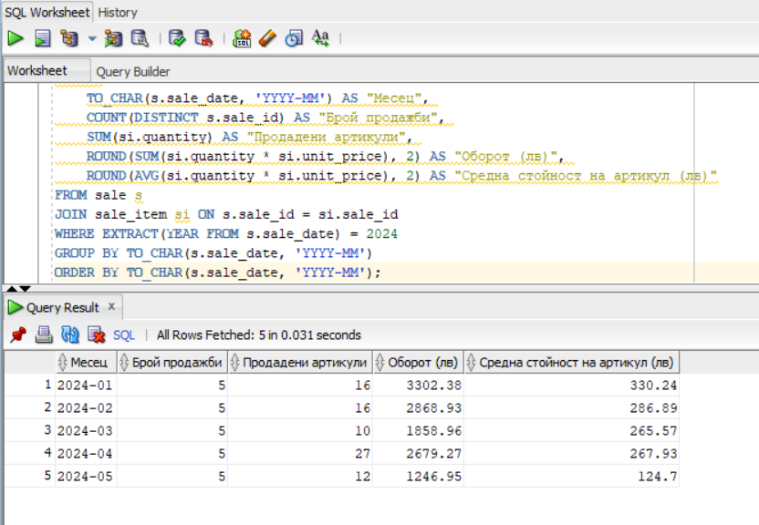
> Файл: `query_results/6.4.png`

---

#### Заявка 6.5: Продукти които не са продадени

**Описание:** Списък на продукти, които никога не са били продадени.

**SQL:**
```sql
SELECT 
    p.product_id,
    p.product_name AS "Продукт",
    pg.group_name AS "Група",
    p.price AS "Цена (лв)"
FROM product p
JOIN product_group pg ON p.group_id = pg.group_id
WHERE NOT EXISTS (SELECT 1 FROM sale_item si WHERE si.product_id = p.product_id)
ORDER BY pg.group_name, p.product_name;
```

**Резултат:**
> 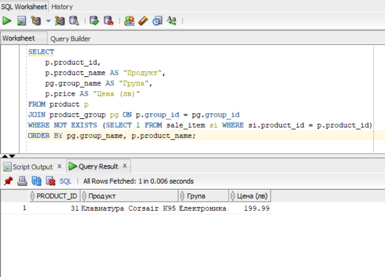
> Файл: `query_results/6.5.png`

---

#### Заявка 6.6: Средна цена по група

**Описание:** Статистика за цените по група продукти - минимална, максимална и средна цена.

**SQL:**
```sql
SELECT 
    pg.group_name AS "Група",
    COUNT(p.product_id) AS "Брой продукти",
    ROUND(MIN(p.price), 2) AS "Мин цена (лв)",
    ROUND(MAX(p.price), 2) AS "Макс цена (лв)",
    ROUND(AVG(p.price), 2) AS "Средна цена (лв)"
FROM product p
JOIN product_group pg ON p.group_id = pg.group_id
GROUP BY pg.group_name
ORDER BY AVG(p.price) DESC;
```

**Резултат:**
> 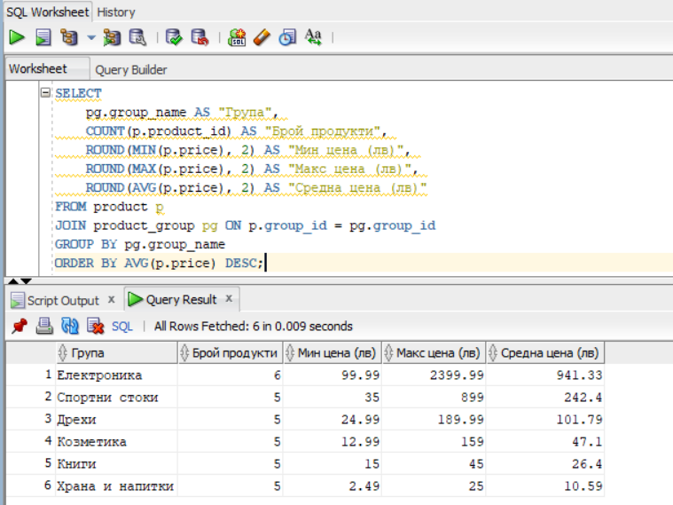
> Файл: `query_results/6.6.png`

---

#### Заявка 6.7: Продажби по ден от седмицата

**Описание:** Статистика за продажбите по ден от седмицата.

**SQL:**
```sql
SELECT 
    TO_CHAR(s.sale_date, 'Day') AS "Ден",
    COUNT(DISTINCT s.sale_id) AS "Брой продажби",
    SUM(si.quantity) AS "Продадени артикули",
    ROUND(SUM(si.quantity * si.unit_price), 2) AS "Оборот (лв)"
FROM sale s
JOIN sale_item si ON s.sale_id = si.sale_id
GROUP BY TO_CHAR(s.sale_date, 'Day'), TO_CHAR(s.sale_date, 'D')
ORDER BY TO_CHAR(s.sale_date, 'D');
```

**Резултат:**
> 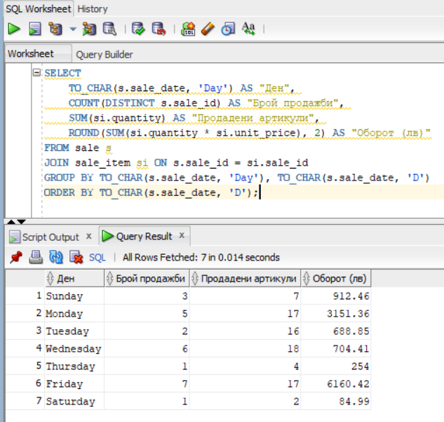
> Файл: `query_results/6.7.png`

---

#### Заявка 6.8: Всички служители с техните позиции

**Описание:** Списък на всички служители с техните позиции и телефони.

**SQL:**
```sql
SELECT 
    e.employee_id AS "ID",
    e.employee_name AS "Служител",
    pos.position_name AS "Позиция",
    e.phone AS "Телефон"
FROM employee e
JOIN position pos ON e.position_id = pos.position_id
ORDER BY pos.position_name, e.employee_name;
```

**Резултат:**
> 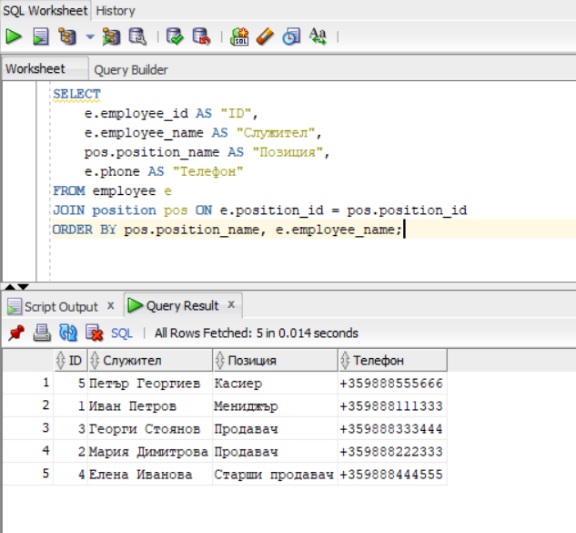
> Файл: `query_results/6.8.png`

---

#### Заявка 6.9: Брой служители по позиция

**Описание:** Статистика за броя служители по позиция/длъжност.

**SQL:**
```sql
SELECT 
    pos.position_name AS "Позиция",
    COUNT(e.employee_id) AS "Брой служители"
FROM position pos
LEFT JOIN employee e ON pos.position_id = e.position_id
GROUP BY pos.position_name
ORDER BY COUNT(e.employee_id) DESC;
```

**Резултат:**
> 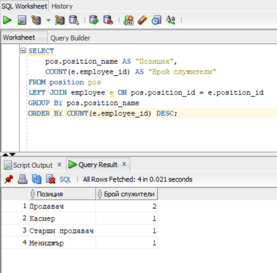
> Файл: `query_results/6.9.png`

---

#### Заявка 6.10: Средна стойност на продажба (кошница)

**Описание:** Всички продажби с техните стойности, подредени по обща сума (най-голямата кошница първо).

**SQL:**
```sql
SELECT 
    s.sale_id AS "ID Продажба",
    s.sale_date AS "Дата",
    c.client_name AS "Клиент",
    COUNT(si.sale_item_id) AS "Брой артикули",
    SUM(si.quantity) AS "Общо бройки",
    ROUND(SUM(si.quantity * si.unit_price), 2) AS "Обща сума (лв)"
FROM sale s
JOIN client c ON s.client_id = c.client_id
JOIN sale_item si ON s.sale_id = si.sale_id
GROUP BY s.sale_id, s.sale_date, c.client_name
ORDER BY SUM(si.quantity * si.unit_price) DESC;
```

**Резултат:**
> 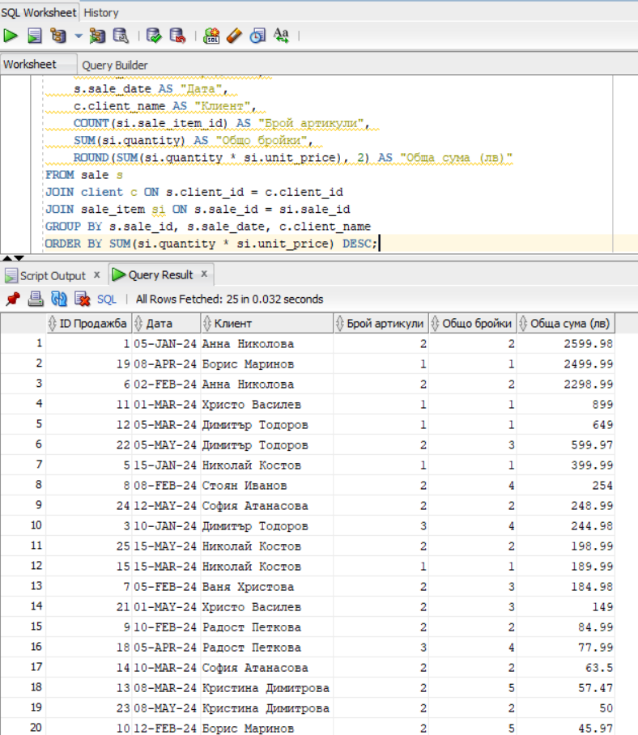
> Файл: `query_results/6.10.png`

---

#### Заявка 6.11: Използване на VIEW v_sale_details

**Описание:** Използване на предварително дефиниран VIEW за детайлна информация за продажбите.

**SQL:**
```sql
SELECT * FROM v_sale_details
ORDER BY sale_date DESC, sale_id;
```

**Резултат:**
> 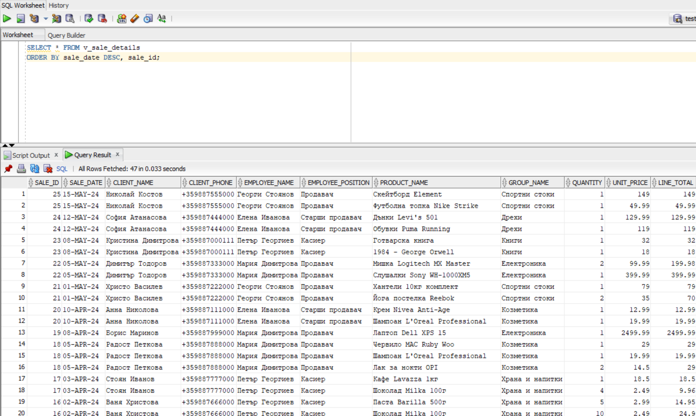
> Файл: `query_results/6.11.png`

---

#### Заявка 6.12: Използване на VIEW v_sale_summary

**Описание:** Използване на предварително дефиниран VIEW за обобщена информация за продажбите.

**SQL:**
```sql
SELECT * FROM v_sale_summary
ORDER BY total_amount DESC;
```

**Резултат:**
> 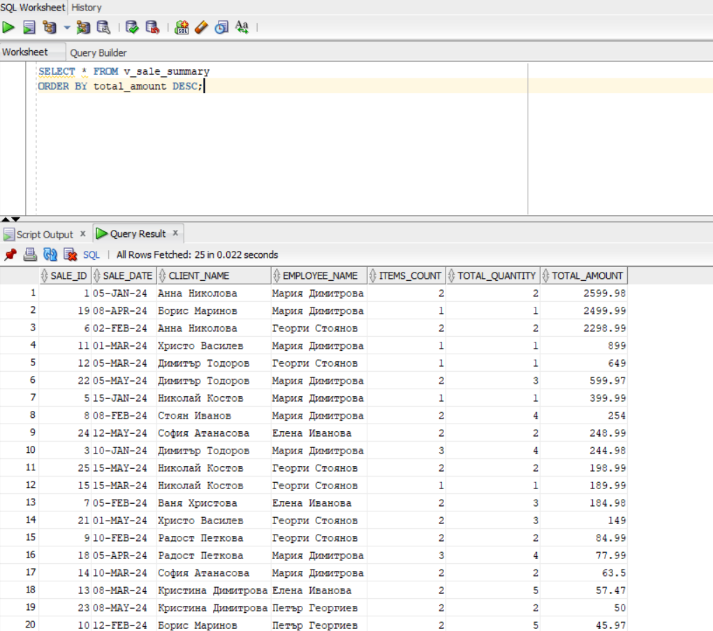
> Файл: `query_results/6.12.png`

---

## 8. ОПТИМИЗАЦИЯ

### 8.1 Индекси

Създадени са **14 индекса** за оптимизация на заявките:

| Индекс               | Таблица    | Колона        | Цел                               |
|----------------------|------------|---------------|-----------------------------------|
| PK индекси           | Всички     | *_id          | Бърз достъп по уникален ключ      |
| idx_product_name     | PRODUCT    | product_name  | Търсене по име на продукт         |
| idx_product_price    | PRODUCT    | price         | Търсене по ценови диапазон        |
| idx_product_group    | PRODUCT    | group_id      | Филтриране по група               |
| idx_employee_name    | EMPLOYEE   | employee_name | Търсене на служител               |
| idx_employee_position| EMPLOYEE   | position_id   | Филтриране по позиция             |
| idx_client_name      | CLIENT     | client_name   | Търсене на клиент                 |
| idx_sale_date        | SALE       | sale_date     | Филтриране по период              |
| idx_sale_client      | SALE       | client_id     | JOIN оптимизация                  |
| idx_sale_employee    | SALE       | employee_id   | JOIN оптимизация                  |
| idx_sale_item_sale   | SALE_ITEM  | sale_id       | JOIN оптимизация                  |
| idx_sale_item_product| SALE_ITEM  | product_id    | JOIN оптимизация                  |

### 8.2 View оптимизация

`v_sale_details` и `v_sale_summary` views съкращават сложни JOIN заявки:

**Без view:**
```sql
SELECT s.sale_id, p.product_name, pg.group_name, c.client_name, 
       e.employee_name, pos.position_name, si.quantity, si.unit_price
FROM sale s
JOIN client c ON s.client_id = c.client_id
JOIN employee e ON s.employee_id = e.employee_id
JOIN position pos ON e.position_id = pos.position_id
JOIN sale_item si ON s.sale_id = si.sale_id
JOIN product p ON si.product_id = p.product_id
JOIN product_group pg ON p.group_id = pg.group_id;
```

**С view:**
```sql
SELECT * FROM v_sale_details;
```

### 8.3 Референциална цялост

**ON DELETE RESTRICT** на повечето foreign keys гарантира:
- Не може да се изтрие продукт който има продажби
- Не може да се изтрие клиент който има история на покупки
- Не може да се изтрие служител който е обслужил продажби
- Не може да се изтрие група докато има продукти в нея
- Не може да се изтрие позиция докато има служители на тази позиция

**ON DELETE CASCADE** на SALE_ITEM→SALE гарантира:
- При изтриване на продажба, автоматично се изтриват всички артикули

---
